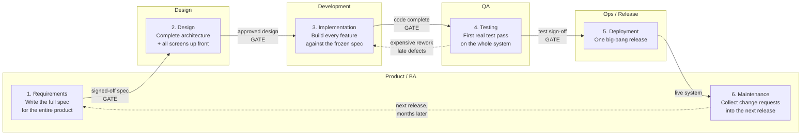

# Artifact: SDLC Swimlane Diagram — Annotated

**Project:** `icstars-rfp-molson-cycle21-carl-` · Molson Cycle 21 RFP
**Author:** Carl Lewis · 2026-10-08

---

## 1. The six phases (SD.KU1)

| # | Phase | One-line purpose |
| --- | --- | --- |
| 1 | **Requirements** | Decide *what* to build and why it is worth building |
| 2 | **Design** | Decide *how* it will be built — architecture, data, interface |
| 3 | **Implementation** | Write the code |
| 4 | **Testing** | Prove the code does what the requirements said |
| 5 | **Deployment** | Put it in front of real users |
| 6 | **Maintenance** | Keep it working and feed what you learn back into phase 1 |

Phase 6 loops back to phase 1 in both methodologies. That loop is the whole lifecycle — "cycle" is not decoration in the name.

---

## 2. Waterfall swimlane — one pass, gated

**Plain-text swimlane (same content):**

| Lane | 1. Requirements | 2. Design | 3. Implementation | 4. Testing | 5. Deployment | 6. Maintenance |
| --- | --- | --- | --- | --- | --- | --- |
| Product / BA | Writes the complete spec for the whole product | Answers clarifying questions | *Idle* — spec is frozen | *Idle* | Approves go-live | Collects change requests for the next release |
| Design | *Idle* | Produces full architecture and every screen | Hands over, then idle | *Idle* | — | — |
| Development | *Idle* | Reviews feasibility | Builds every feature against the frozen spec | Fixes defects found late | Hands off a build | Patches |
| QA | *Idle* | Writes a test plan from the spec | *Idle* — nothing testable yet | First real test pass, on the whole system at once | Smoke-tests production | Regression on patches |
| Ops / Release | *Idle* | Plans infrastructure | *Idle* | Prepares the environment | One big-bang release | Monitors, restores |

**What the diagram shows:** each lane is busy in exactly one phase and idle the rest of the time. Work moves forward through four hard gates and only flows backward as rework. QA's first genuine feedback arrives in phase 4 — potentially months after the decision that caused the defect, which is exactly why that rework arrow is expensive.

---

## 3. Agile swimlane — same six phases, compressed into every sprint

```mermaid
flowchart LR
  subgraph S1["Sprint N"]
    direction TB
    A1["Product / BA<br/>1. Refine 2-3 stories<br/>+ acceptance criteria"]
    A2["Design<br/>2. Design just<br/>this sprint's slice"]
    A3["Development<br/>3. Build the slice"]
    A4["QA<br/>4. Test as each<br/>task completes"]
    A5["Ops<br/>5. Ship behind<br/>a feature flag"]
    A1 --> A2 --> A3 --> A4 --> A5
    A4 -.->|"same-day fix"| A3
  end

  subgraph S2["Sprint N+1"]
    direction TB
    B1["Product / BA<br/>1. Refine next stories,<br/>informed by the demo"]
    B2["Design<br/>2. Design next slice"]
    B3["Development<br/>3. Build next slice"]
    B4["QA<br/>4. Test continuously"]
    B5["Ops<br/>5. Ship again"]
    B1 --> B2 --> B3 --> B4 --> B5
    B4 -.->|"same-day fix"| B3
  end

  REV["Review + Retro<br/>6. Maintenance / feedback<br/>working software demoed"]

  A5 --> REV
  REV -->|"what we learned<br/>reorders the backlog"| B1
  B5 --> REV2["Review + Retro<br/>…and repeat"]
```

**Plain-text swimlane (same content):**

| Lane | Within **every** 2-week sprint |
| --- | --- |
| Product / BA | Refines the next 2–3 stories into Given/When/Then criteria **while** the current sprint is being built; accepts finished stories at review |
| Design | Designs only the slice in flight; design and build overlap rather than queue |
| Development | Builds the slice; pairs with QA on the acceptance criteria before writing code |
| QA | Tests each task the day it lands — testing is continuous, not a phase at the end |
| Ops / Release | Ships every sprint, behind a feature flag if the slice is incomplete |
| **Whole team** | Review + retro closes the loop; what is learned reorders the backlog for the next sprint |

**What the diagram shows:** no lane is idle. All six phases happen inside each sprint, on a thin vertical slice of the product, and the loop from phase 6 back to phase 1 closes in two weeks instead of two quarters.

---

## 4. Phase-by-phase annotation (SD.SK1)

### Phase 1 — Requirements
- **Input:** a business need, a user complaint, a stakeholder request
- **Activities:** interview users, write user stories, define acceptance criteria, prioritize
- **Exit artifact:** a prioritized backlog of stories with acceptance criteria
- **Waterfall:** the entire spec is written and frozen before any code exists
- **Agile:** only the next sprint or two is detailed; the rest of the backlog stays coarse on purpose

### Phase 2 — Design
- **Input:** approved stories
- **Activities:** data model, API contracts, wireframes, choice of architecture
- **Exit artifact:** a design the team can build from
- **Waterfall:** full system design, approved at a gate, before implementation starts
- **Agile:** "just enough" design for this sprint's slice; the architecture is allowed to evolve

### Phase 3 — Implementation
- **Input:** a design plus acceptance criteria
- **Activities:** write code, write unit tests, code review, commit
- **Exit artifact:** working code merged to the main branch
- **Waterfall:** one long build phase covering every feature
- **Agile:** a shippable increment every sprint

### Phase 4 — Testing
- **Input:** merged code and the acceptance criteria it claims to satisfy
- **Activities:** execute test cases, log defects, retest fixes, regression
- **Exit artifact:** a test report and a defect log
- **Waterfall:** a distinct phase after all code is written
- **Agile:** continuous, inside the sprint; a story is not "done" until it is tested

### Phase 5 — Deployment
- **Input:** a build that has passed testing
- **Activities:** release to production, migrate data, monitor, roll back if needed
- **Exit artifact:** software running in front of real users
- **Waterfall:** one big-bang release, high risk because everything changes at once
- **Agile:** small frequent releases, low risk because each change is small and reversible

### Phase 6 — Maintenance
- **Input:** real production usage
- **Activities:** fix defects, monitor performance, gather feedback, support users
- **Exit artifact:** change requests that become phase-1 input again
- **Waterfall:** a long tail after the project "ends"; the next version is a new project
- **Agile:** folded into the next sprint's backlog — there is no "after the project"

---

## 5. Where Agile and Waterfall differ (SD.SK2)

The key point: **both use the same six phases. The difference is cadence, batch size, and when feedback arrives.**

| Dimension | Waterfall | Agile |
| --- | --- | --- |
| Phase sequence | Once, start to finish | Repeated every sprint |
| Batch size | The whole product | One thin slice — 2–3 stories |
| Requirements | Frozen after sign-off; changes go through change control | Expected to change; backlog is reordered every sprint |
| When working software first appears | Near the end of the project | End of sprint 1 |
| When QA first gives feedback | Phase 4, possibly months in | Within days, inside the sprint |
| Cost of a late change | High — ripples back through signed-off gates | Low — it is just a backlog reorder |
| Documentation | Heavy, up front, contractual | Lighter, continuous, just-in-time |
| Customer involvement | Start and end | Every sprint review |
| Progress measured by | Phases completed against the plan | Working software demoed |
| Biggest risk | Building the wrong thing correctly and finding out too late | Scope drift and architectural debt if refinement is skipped |
| Fits best when | Requirements are genuinely fixed and regulated — compliance, hardware, fixed-bid contracts | Requirements will be discovered through use — most software products |

**The honest tradeoff:** Waterfall is not a mistake, it is a bet that you already know the requirements. Agile is a bet that you do not and would rather find out in two weeks than two quarters. On this project we do not fully know the requirements, so Agile is the cheaper bet.

---

## 6. How our current project reflects Agile practices

> **Project note (required connection to real work):** Our Molson Cycle 21 build in this repo is running Agile, not Waterfall, and the evidence is in the repo itself.
>
> We did **not** write a full spec for the finished product before coding. The first commit on `main` — `df0b998 Add CSV Hello World uploader` — is a deliberately thin vertical slice: it touches `index.html`, `script.js`, and `style.css` and delivers one end-to-end behavior a user can actually see, rather than a complete front end built against a frozen design. That is phases 1 through 5 compressed into a single increment, which is the Agile pattern in the diagram above.
>
> Our backlog is refined just-in-time rather than all at once. In [Assessment 2 / Task 1](../task-1/refined-backlog.md) we refined exactly two stories — `STORY-101` login and `STORY-102` password reset — into sprint-ready items with acceptance criteria, six tasks, estimates and owners, and we deliberately left `RAW-3`, `RAW-4`, and `RAW-5` coarse and marked **Not Ready**. A Waterfall team would have had to specify all five before starting; we specified the two we are about to build.
>
> Our testing is inside the sprint, not after it. The acceptance criteria on `STORY-101` were written **before** the code, and [Assessment 2 / Task 3](../task-3/test-plan.md) turns those same criteria into executable test cases — including `DEF-001`, a defect found and logged during the sprint rather than in a separate testing phase months later. In the Waterfall diagram that feedback arrow is the expensive one; in ours it closes same-day.
>
> We also commit to less than our velocity: 8 of 13 available points, with a stated 7-hour buffer for review rework. That is empirical planning based on measured velocity, not a plan-driven schedule.
>
> **Where we are not yet fully Agile — honest assessment:** we are not yet shipping behind feature flags, so the Ops lane in our real sprint is thinner than the Agile diagram shows, and we do not yet have CI running the test suite automatically on every push. Both are on the improvement list from our retro. Naming the gap is part of the practice.
