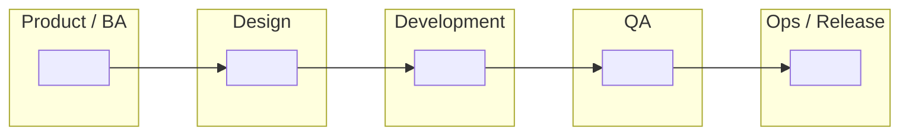

# Task 2 Submission — SDLC Swimlane Diagram

**Apprentice name:**
**Date:**
**Project:**

---

## Part 1 — The SDLC phases

List the phases in the order they happen. **Add or remove rows as you need** — the number of rows below is not the answer, and working out how many there are is part of the task.

| # | Phase name | What happens in it | What comes out of it |
| --- | --- | --- | --- |
| 1 |planning  | define the goals, scope, and overall strategy| clear direction on how the project should be progressing  |
| 2 | design|  documented requirements and business concepts are turned into a actionable blueprint before any code is written|  a rough draft or blue lofi of what the final product should be |
| 3 |development | design blueprints and architecture documents are turned into actual, working source code | a working prototype of the product and every thing that went into the previous sdlc lif cycle before development  |
| 4 | testing| checking software to find bugs, verify functionality against requirements, and ensure reliability before release | making sure the product is something that could be given to a client or needs more work |
| 5 | deployment| the product goes from a private environment into a more public one  to see how it installs, configures, and behaves before real customers use it| Feedback and more UI testing as well as working out any of the last kinks that may arise  |
| 6 | maintiance|updating, fixing, and improving software after it has already been launched and handed over to users |the final product of the cycle which can be given to the client and just needs minor things that dont impded the flow of the app |

**Does anything happen after the last phase? Say what, and where it goes.**

>

---

## Part 2 — Waterfall swimlane

Fill in **either** the table or the Mermaid diagram. Put your own phase names in — nothing is pre-filled, including how many columns or boxes you need.

### Table version

Replace the blank column headers with your phases. The lanes down the left are a starting suggestion — change them if your project's roles are different.

| Lane (role) | | | | | | |
| --- | --- | --- | --- | --- | --- | --- |
| Product / BA | | | | | | |
| Design | | | | | | |
| Development | | | | | | |
| QA | | | | | | |
| Ops / Release | | | | | | |

Leave a cell blank if that role is genuinely idle at that point. Idle cells are information, not gaps.

### Mermaid version

Replace every `" "` with your own content. **Add, remove, and rearrange nodes and arrows as your diagram requires** — this skeleton is scaffolding for the syntax, not a map of the right answer. Label the arrows with what gets handed off.

### How work moves through this diagram

**Where does work have to stop and wait for approval before it can continue? Mark those points on your diagram and list them here.**

>

**Does work ever travel backwards in this model? When, and what does that cost?**

>

---

## Part 3 — Agile swimlane

The same phases from Part 1. Work out for yourself how the arrangement changes — the structure of this diagram is yours to decide, and the shape of it is most of what's being assessed here.

### Table version

Build the grid yourself. Use whatever columns make the Agile arrangement clear; they do not have to be the same columns you used in Part 2.

| Lane (role) | | | |
| --- | --- | --- | --- |
| Product / BA | | | |
| Design | | | |
| Development | | | |
| QA | | | |
| Ops / Release | | | |

### Mermaid version

Same skeleton as Part 2, deliberately. If your Agile diagram ends up looking structurally different from your Waterfall one, that difference is your argument — make it visible here.

### How work moves through this diagram

**Where does work stop and wait here, if anywhere? How does that compare to Part 2?**

>

**Which lanes are busy at the same time, and which sit idle?**

>

---

## Part 4 — Where Agile and Waterfall differ

**Decide for yourself which dimensions are worth comparing.** Three starters are filled in to show the format; name the rest yourself. Aim for at least six rows total — the ones you choose say as much as the ones you fill in.

| Dimension | Waterfall | Agile |
| --- | --- | --- |
| Phase sequence | | |
| How requirements are treated | | |
| Documentation | | |
| | | |
| | | |
| | | |
| | | |
| | | |

**In one or two sentences — what is the single most important difference, and why does it matter?**

>

**Name a project where Waterfall would be the better choice, and say why.**

Neither model is a mistake. Knowing when each one fits is the point of comparing them.

>

---

## Part 5 — How our current project reflects Agile practices

Required. Name **specific, real** things from your project: the repo, the branch, a commit, a sprint, a story, a defect, a ceremony you actually attended. A reviewer should be able to go look at what you cite.

>
>
>

**Where is your project *not* yet fully Agile?** Naming an honest gap is part of the standard, not a deduction.

>

---

## Checklist before you open your pull request

- [ ] Phases listed, and I checked the order
- [ ] Every phase has a description and a named output
- [ ] I answered what happens after the last phase
- [ ] Waterfall diagram filled in — table or Mermaid
- [ ] Agile diagram filled in — table or Mermaid
- [ ] I answered the "how work moves" questions under both diagrams
- [ ] Comparison table has at least six rows, with dimensions I chose
- [ ] Project note names specific real things, not generalities
- [ ] I pushed my branch and viewed this file on GitHub to confirm it renders
