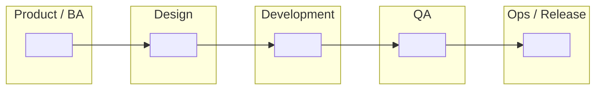

# Task 2 Submission — SDLC Swimlane Diagram

**Apprentice name:**
**Date:**
**Project:**

---

## Part 1 — The SDLC phases

List the phases in the order they happen. **Add or remove rows as you need** — the number of rows below is not the answer, and working out how many there are is part of the task.

| # | Phase name | What happens in it | What comes out of it |
| --- | --- | --- | --- |
| 1 |Planning |Project goals, scope, and restraints are identified, defined, and agreed upon. |A basic idea of the problem and how you can begin to solve it. |
| 2 |Requirement Specification |Non functional requirements are gathered, and documented on an SRS document. |A more complete idea of what a solution could look like. |
| 3 | System Design|Translate the SRS into a technical blueprint or architecture. Define system components, database structures, UI/UX wireframes, and technology stacks.  | The project stars to be defined in further detail. |
| 4 |Development |Write the actual source code based on the design specifications. Split larger objectives into smaller coding tasks, modules, or APIs. |First version of the product is built, maybe this is one of the first progress check done by stakeholders. |
| 5 |Testing |Run unit, integration, system, and user acceptance testing (UAT) to catch bugs. Validate that the software meets quality standards and business needs. |Product is adjusted to needs, and bugs are fixed. Changes made. |
| 6 |Deployment |Release the software to production or hand it over to end-users.Roll out via cloud infrastructure, on-premise servers, or app stores. | Official launch of product.|
| 7 |Maintenance | Provide ongoing support, patch security vulnerabilities, fix post-launch bugs, and add new features.| Updates are rolled out and bugs are fixed, especially early on, a lot of hot fixes. |
**Does anything happen after the last phase? Say what, and where it goes.**

>Yes, maintenance happens, you have to keep updating the product so that none of the tech is left behind as the rest of the tech world updates and innovates. It goes in Phase 7.

---

## Part 2 — Waterfall swimlane

Fill in **either** the table or the Mermaid diagram. Put your own phase names in — nothing is pre-filled, including how many columns or boxes you need.

### Table version

Replace the blank column headers with your phases. The lanes down the left are a starting suggestion — change them if your project's roles are different.

| Lane (role) |1 |2 |3 |4 |5 |6 | 7|
| --- | --- | --- | --- | --- | --- | --- | --- |
| Product / BA |x |x | x| x| x| x| x|
| Design |x |x | x| | x| x| x|
| Development | | | | x|x |x|x |
| QA | x|x |x | | x| |x |
| Ops / Release |x |x | x| |x |x |x |

Leave a cell blank if that role is genuinely idle at that point. Idle cells are information, not gaps.

### Mermaid version

Replace every `" "` with your own content. **Add, remove, and rearrange nodes and arrows as your diagram requires** — this skeleton is scaffolding for the syntax, not a map of the right answer. Label the arrows with what gets handed off.

### How work moves through this diagram

**Where does work have to stop and wait for approval before it can continue? Mark those points on your diagram and list them here.**

>

**Does work ever travel backwards in this model? When, and what does that cost?**

>

---

## Part 3 — Agile swimlane

The same phases from Part 1. Work out for yourself how the arrangement changes — the structure of this diagram is yours to decide, and the shape of it is most of what's being assessed here.

### Table version

Build the grid yourself. Use whatever columns make the Agile arrangement clear; they do not have to be the same columns you used in Part 2.

| Lane (role) |1 |2 |3 |4 |5 | 
| --- | --- | --- | --- | --- | --- | 
| Product / BA |x |x | x| x| x|  
| Design |x |x | x| | x|  
| Development | | | | x|x |
| QA | x|x |x | | x| 
| Ops / Release |x |x | x| |x 

When all is done then finally the product is deployed and mantained.

### Mermaid version

Same skeleton as Part 2, deliberately. If your Agile diagram ends up looking structurally different from your Waterfall one, that difference is your argument — make it visible here.

### How work moves through this diagram

**Where does work stop and wait here, if anywhere? How does that compare to Part 2?**

>

**Which lanes are busy at the same time, and which sit idle?**

>

---

## Part 4 — Where Agile and Waterfall differ

**Decide for yourself which dimensions are worth comparing.** Three starters are filled in to show the format; name the rest yourself. Aim for at least six rows total — the ones you choose say as much as the ones you fill in.

| Dimension | Waterfall | Agile |
| --- | --- | --- |
| Phase sequence |1,2,3,4,5,6,7 |It adjusts with the necessities of the project. |
| How requirements are treated |Extremely rigid Musts |They are still met but there is more flexibility with how they are met. |
| Documentation |It is all in a linear step by step sequence. | In the way it happens which is often not sequential in the agile method. |
| | | |
| | | |
| | | |
| | | |
| | | |

**In one or two sentences — what is the single most important difference, and why does it matter?**

>Agile is malleable and flexible to the project's needs.

**Name a project where Waterfall would be the better choice, and say why.**

Neither model is a mistake. Knowing when each one fits is the point of comparing them.

>For something that is related to Military defense because it is something that needs extremely precise documentation and someone needs to be able to know exactly what step the team is and what is happening. 

---

## Part 5 — How our current project reflects Agile practices

Required. Name **specific, real** things from your project: the repo, the branch, a commit, a sprint, a story, a defect, a ceremony you actually attended. A reviewer should be able to go look at what you cite.

> The whole project because we have the freedom to work as we need to.
>This assignment because we can do what we feel is easier or hardest first or second depending on preferance which improves overall performance.
>Preparation for IOpener, because we are allowed to choose whoever we want to connect with and almost what to talk about with them.

**Where is your project *not* yet fully Agile?** Naming an honest gap is part of the standard, not a deduction.

> We aren't fully agile in the deliverables because we are still going very much in order of what is due without the freedom of choice.

---

## Checklist before you open your pull request

- [x ] Phases listed, and I checked the order
- [ x] Every phase has a description and a named output
- [ x] I answered what happens after the last phase
- [x ] Waterfall diagram filled in — table or Mermaid
- [x ] Agile diagram filled in — table or Mermaid
- [x ] I answered the "how work moves" questions under both diagrams
- [ x] Comparison table has at least six rows, with dimensions I chose
- [ x] Project note names specific real things, not generalities
- [ x] I pushed my branch and viewed this file on GitHub to confirm it renders
