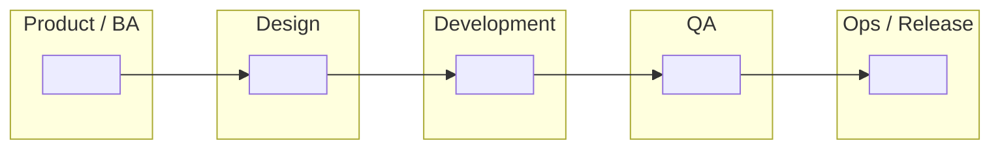

# Task 2 Submission — SDLC Swimlane Diagram

**Apprentice name:** Jose Romero
**Date:** 10/8/2026
**Project:** Task 2

---

## Part 1 — The SDLC phases

List the phases in the order they happen. **Add or remove rows as you need** — the number of rows below is not the answer, and working out how many there are is part of the task.

| # | Phase name | What happens in it | What comes out of it |
| --- | --- | --- | --- |
| 1 |Requirements |Typically, this begins with a kick-off call with a customer or client. Conversations are had to determine what requirements are needed in the final product. Whether or not this phase is revisited and how it is revisited is dependent on the chosen methodology. |Often times a contract is the result of this. A written document that details the terms of the agreement and what the client's expectations are for a final product. |
| 2 |Design |UX, UI, and system design architects tend to operate here. This is where the requirements are used to more or less determine what the design will be. How the product will work, what it will look like, how it will meet the requirements, etc. |Typically things like a wireframe, database design, or diagrams showing how data flows through a program is the result of the design phase. |
| 3 |Development |In software development, this is where coding happens. Some people might write tests BEFORE doing any actual coding, but traditionally, this is where things start getting built that align with the requirements and design. Changes may get made, but again, this depends on the methodology chosen. |The outcome is often something like an MVP that can be used. If using waterfall, usually the result is a fully build system. Otherwise, it could just be a single component or two of a full system. |
| 4 |Testing |This is where unit tests, integration tests, acceptance tests, etc. are held to make sure that the products works as intended. |Often, failed or accepted tests is the outcome. Some documentation might be made too if you are using waterfall. |
| 5 |Deploy |This is where the product is put out in a production environment. Users are now able to use the product and potentially provide feedback. |Often times, the outcome is feedback from a client. It could also be bugs that were not caught in the testing phase. |
| 6 |Review |This is where users use the product and start sending the feedback to developers. This is also where things like routine maintenance of a system could occur. |The result is often times new tasks to work on and restart the cycle with. The requirements phase would start up again, this time using the feedback from the review phase. |

**Does anything happen after the last phase? Say what, and where it goes.**

> Usually maintenance (like the maintenance updates one may get for an app or something). Security updates should happen regularly, and if a client is not doing that themselves, then developers may provide that, but it depends on what sort of agreement was made.

---

## Part 2 — Waterfall swimlane

Fill in **either** the table or the Mermaid diagram. Put your own phase names in — nothing is pre-filled, including how many columns or boxes you need.

### Table version

Replace the blank column headers with your phases. The lanes down the left are a starting suggestion — change them if your project's roles are different.

| Lane (role) |Requirements |Design |Development |Testing |Deployment |Review |
| --- | --- | --- | --- | --- | --- | --- |
| Product / BA |x | | | | |x |
| Design | |x | | | | |
| Development | |x |x | | | |
| QA | | | | x| | |
| Ops / Release | | |x |x |x |x |

Leave a cell blank if that role is genuinely idle at that point. Idle cells are information, not gaps.

### Mermaid version

Replace every `" "` with your own content. **Add, remove, and rearrange nodes and arrows as your diagram requires** — this skeleton is scaffolding for the syntax, not a map of the right answer. Label the arrows with what gets handed off.

### How work moves through this diagram

**Where does work have to stop and wait for approval before it can continue? Mark those points on your diagram and list them here.**

> In waterfall, waiting is part of the game. In waterfall, months or even years can pass before code is written. In theory, you should never move on to a phase or move backward in waterfall. Approvals to move forward are likely needed after every phase.

**Does work ever travel backwards in this model? When, and what does that cost?**

> Work generally does not travel backwards in waterfall. Waterfall follows strict consecutive phases and creates documentation after each phase.

---

## Part 3 — Agile swimlane

The same phases from Part 1. Work out for yourself how the arrangement changes — the structure of this diagram is yours to decide, and the shape of it is most of what's being assessed here.

### Table version

Build the grid yourself. Use whatever columns make the Agile arrangement clear; they do not have to be the same columns you used in Part 2.

| Lane (role) |Requirements |Design |Development |Testing |Deployment |Review |
| --- | --- | --- | --- | --- | --- | --- |
| Product / BA |x | | | | |x |
| Design | |x | | | | |
| Development | |x |x | | | |
| QA | | | | x| | |
| Ops / Release | | |x |x |x |x |

### Mermaid version

Same skeleton as Part 2, deliberately. If your Agile diagram ends up looking structurally different from your Waterfall one, that difference is your argument — make it visible here.

### How work moves through this diagram

**Where does work stop and wait here, if anywhere? How does that compare to Part 2?**

>In agile, things are basically always moving. Agile has more an emphasis on doing things as opposed to moving one phase at a time and creating documentation like in waterfall.

**Which lanes are busy at the same time, and which sit idle?**

>In agile, requirements and review is sort of happening all the time. Client involvement is pretty important in agile, as the client is ideally giving feedback throughout development. So if there is a phase that overlaps a lot, its requirements, and review as well since the client is giving a lot of feedback.

---

## Part 4 — Where Agile and Waterfall differ

**Decide for yourself which dimensions are worth comparing.** Three starters are filled in to show the format; name the rest yourself. Aim for at least six rows total — the ones you choose say as much as the ones you fill in.

| Dimension | Waterfall | Agile |
| --- | --- | --- |
| Phase sequence | | |
| How requirements are treated | | |
| Documentation | | |
| | | |
| | | |
| | | |
| | | |
| | | |

**In one or two sentences — what is the single most important difference, and why does it matter?**

>Waterfall moves one phase at a time and should not go backward. Agile is more open to moving forward or backward depending on the client needs. 

**Name a project where Waterfall would be the better choice, and say why.**

Neither model is a mistake. Knowing when each one fits is the point of comparing them.

>

---

## Part 5 — How our current project reflects Agile practices

Required. Name **specific, real** things from your project: the repo, the branch, a commit, a sprint, a story, a defect, a ceremony you actually attended. A reviewer should be able to go look at what you cite.

>
>
>

**Where is your project *not* yet fully Agile?** Naming an honest gap is part of the standard, not a deduction.

>

---

## Checklist before you open your pull request

- [ ] Phases listed, and I checked the order
- [ ] Every phase has a description and a named output
- [ ] I answered what happens after the last phase
- [ ] Waterfall diagram filled in — table or Mermaid
- [ ] Agile diagram filled in — table or Mermaid
- [ ] I answered the "how work moves" questions under both diagrams
- [ ] Comparison table has at least six rows, with dimensions I chose
- [ ] Project note names specific real things, not generalities
- [ ] I pushed my branch and viewed this file on GitHub to confirm it renders
