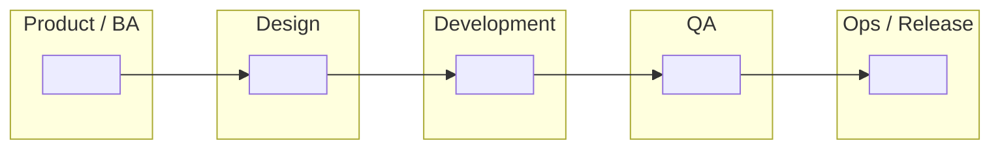

# Task 2 Submission — SDLC Swimlane Diagram

**Apprentice name:** Amir
**Date:** 10/08/2026
**Project:** Tap Track

---

## Part 1 — The SDLC phases

List the phases in the order they happen. **Add or remove rows as you need** — the number of rows below is not the answer, and working out how many there are is part of the task.

| # | Phase name | What happens in it | What comes out of it |
| --- | --- | --- | --- |
| 1 | Planning | Define goals, scope, timeline | Planning the project |
| 2 | Requirements | Gather and document client's needs | Requirements document |
| 3 | Design | Create the design and user interface | Application's Design |
| 4 | Development | Build the application and implement features | Working software |
| 5 | Testing | Verify features and check for bugs and  defects | Test results |
| 6 | Deployment | Release the application to users | Production time |

**Does anything happen after the last phase? Say what, and where it goes.**

>Yes. Feedback, bug reports, and new feature requests depending on the client's need.

---

## Part 2 — Waterfall swimlane

Fill in **either** the table or the Mermaid diagram. Put your own phase names in — nothing is pre-filled, including how many columns or boxes you need.

### Table version

Replace the blank column headers with your phases. The lanes down the left are a starting suggestion — change them if your project's roles are different.

| Lane (role) | Planning | Requirements | Design | Development | Testing | Deployment | Maintenance |
| --- | --- | --- | --- | --- | --- | --- | --- |
| Product / BA | x | x | x |  | x | x | x |
| Design |  | x | x |  |  |  | x |
| Development |  | x | x | x | x | x | x |
| QA |  | x | x | x | x | x | x |
| Ops / Release |  |  |  | x |  | x | x |

Leave a cell blank if that role is genuinely idle at that point. Idle cells are information, not gaps.

### Mermaid version

Replace every `" "` with your own content. **Add, remove, and rearrange nodes and arrows as your diagram requires** — this skeleton is scaffolding for the syntax, not a map of the right answer. Label the arrows with what gets handed off.

### How work moves through this diagram

**Where does work have to stop and wait for approval before it can continue? Mark those points on your diagram and list them here.**

>After each phase like requirements, design etc and before Deployment.

**Does work ever travel backwards in this model? When, and what does that cost?**

>Yes. If when we are testing we finds bugs,we will return to development for fixes. This causes delays and extra documentation.

---

## Part 3 — Agile swimlane

The same phases from Part 1. Work out for yourself how the arrangement changes — the structure of this diagram is yours to decide, and the shape of it is most of what's being assessed here.

### Table version

Build the grid yourself. Use whatever columns make the Agile arrangement clear; they do not have to be the same columns you used in Part 2.

| Lane (role) | Sprint Planning & Stories | Development & Testing | Review & Release |
| --- | --- | --- | --- |
| Product / BA | Backlog and create user stories | Answer questions and give feedback | Check if stories are completed |
| Design | Design features for sprint | Support developers | Check for future designs |
| Development | Estimate work and plan sprint | Build features and fix bugs | Demo completed work |
| QA | Define acceptance criteria | Test continuously during development | Verify completed stories |
| Ops / Release | Prepare deployment process | Support builds and environments | Deploy working increment |

### Mermaid version

Same skeleton as Part 2, deliberately. If your Agile diagram ends up looking structurally different from your Waterfall one, that difference is your argument — make it visible here.

### How work moves through this diagram

**Where does work stop and wait here, if anywhere? How does that compare to Part 2?**

>Work stops less often in Agile. Developers, testers, and product owners collaborate throughout the sprint. Small approvals happen continuously instead of waiting for an entire phase to finish.

**Which lanes are busy at the same time, and which sit idle?**

>Product/BA, Design, Development, QA.

---

## Part 4 — Where Agile and Waterfall differ

**Decide for yourself which dimensions are worth comparing.** Three starters are filled in to show the format; name the rest yourself. Aim for at least six rows total — the ones you choose say as much as the ones you fill in.

| Dimension | Waterfall | Agile |
| --- | --- | --- |
| Phase sequence | Linear and sequential | Iterative and repetitive |
| How requirements are treated | Defined early and rarely changed | Updated as needed throughout the project |
| Documentation | Extensive documentation | Lightweight documentation |
| Testing | Mostly after development | Continuous throughout development |
| Customer involvement | Limited checkpoints | Frequent feedback and reviews |
| Delivery schedule | One major release | Small releases every sprint |
| Handling changes | Changes are difficult and costly | Changes are expected and welcomed |
| Team collaboration | Teams work mostly by phase | Teams collaborate continuously |
 
**In one or two sentences — what is the single most important difference, and why does it matter?**
 
> The most important difference is that Agile allows continuous feedback and change throughout development. This helps teams adapt to new requirements and deliver value more quickly.

**Name a project where Waterfall would be the better choice, and say why.**

Neither model is a mistake. Knowing when each one fits is the point of comparing them.

>A government payroll system would be a good Waterfall project because requirements are usually fixed, changes are expensive, and extensive documentation and approval processes are required.

---

## Part 5 — How our current project reflects Agile practices

Required. Name **specific, real** things from your project: the repo, the branch, a commit, a sprint, a story, a defect, a ceremony you actually attended. A reviewer should be able to go look at what you cite.

>Our team is developing an IT Service Management Portal that allows users to view Tickets, Incidents, and Changes.

> The project is being developed using user stories such as "View Tickets," "View Incidents," and "View Changes." Features are completed in small increments rather than all at once.

> The team reviews progress regularly, receives feedback, and updates work during each sprint before moving to the next set of stories.

**Where is your project *not* yet fully Agile?** Naming an honest gap is part of the standard, not a deduction.

>We do not yet release updates continuously, and some project decisions still require formal approval before changes are implemented.

---

## Checklist before you open your pull request

- [x] Phases listed, and I checked the order
- [x] Every phase has a description and a named output
- [x] I answered what happens after the last phase
- [x] Waterfall diagram filled in — table or Mermaid
- [x] Agile diagram filled in — table or Mermaid
- [x] I answered the "how work moves" questions under both diagrams
- [x] Comparison table has at least six rows, with dimensions I chose
- [x] Project note names specific real things, not generalities
- [x] I pushed my branch and viewed this file on GitHub to confirm it renders
