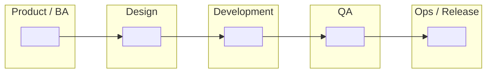
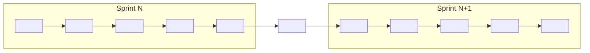

# Task 2 Submission — SDLC Swimlane Diagram

**Apprentice name:**
**Date:**
**Project:**

---

## Part 1 — The SDLC phases

List the phases in the order they happen. Add or remove rows as needed — the number of rows here is not a hint.

| # | Phase name | What happens in it | What comes out of it |
| --- | --- | --- | --- |
| 1 | | | |
| 2 | | | |
| 3 | | | |
| 4 | | | |
| 5 | | | |
| 6 | | | |

---

## Part 2 — Waterfall swimlane

Fill in **either** the table or the Mermaid diagram below. Put your phase names in the column headers.

### Table version

| Lane (role) | | | | | | |
| --- | --- | --- | --- | --- | --- | --- |
| Product / BA | | | | | | |
| Design | | | | | | |
| Development | | | | | | |
| QA | | | | | | |
| Ops / Release | | | | | | |

Leave a cell blank if that role is genuinely idle during that phase. Idle cells are information, not gaps.

### Mermaid version

Replace the `" "` placeholders with your phase names and the work done in each. Add or remove nodes as needed. Label the arrows with what gets handed off.

### Where are the gates?

A gate is a point where work cannot continue until something is approved. Mark them on your diagram and list them here.

>

---

## Part 3 — Agile swimlane

Same phases. Show how the cadence changes.

### Table version

| Lane (role) | What this role does inside a single sprint |
| --- | --- |
| Product / BA | |
| Design | |
| Development | |
| QA | |
| Ops / Release | |
| Whole team | |

### Mermaid version

---

## Part 4 — Where Agile and Waterfall differ

| Dimension | Waterfall | Agile |
| --- | --- | --- |
| Phase sequence | | |
| Batch size | | |
| How requirements are treated | | |
| When working software first appears | | |
| When QA first gives feedback | | |
| Cost of a late change | | |
| Documentation | | |
| Customer involvement | | |
| How progress is measured | | |
| Biggest risk | | |
| Fits best when | | |

**In one or two sentences — what is the single most important difference, and why does it matter?**

>

---

## Part 5 — How our current project reflects Agile practices

Required. Name **specific, real** things from your project: the repo, the branch, a commit, a sprint, a story, a defect, a ceremony you actually attended. A reviewer should be able to go look at what you cite.

>
>
>

**Where is your project *not* yet fully Agile?** Naming an honest gap is part of the standard, not a deduction.

>

---

## Checklist before you open your pull request

- [ ] At least 5 phases listed, and I checked the order
- [ ] Every phase has a description and a named output
- [ ] Waterfall diagram filled in — table or Mermaid
- [ ] Gates identified
- [ ] Agile diagram filled in — table or Mermaid
- [ ] Comparison table complete
- [ ] Project note names specific real things, not generalities
- [ ] I pushed my branch and viewed this file on GitHub to confirm it renders
