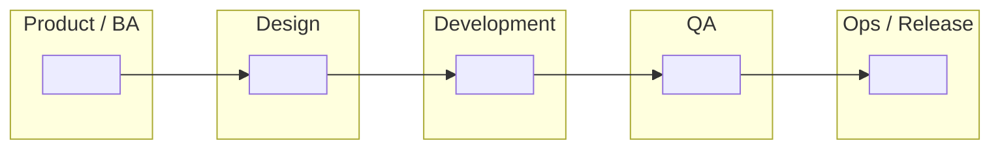

# Blank Swimlane Template (setup)

Use this template to map the SDLC. Fill in each cell with the work that role does during that phase, then mark the hand-off points between lanes.

## Instructions

1. List the SDLC phases across the top, left to right, in the order they occur.
2. List the roles down the left side — these are your **swimlanes**.
3. In each cell, write what that role actually produces during that phase. Leave a cell blank if that role is genuinely idle.
4. Draw the hand-offs: an arrow leaves the cell that produces an artifact and enters the cell that consumes it.
5. Mark every **gate** — a point where work cannot continue until something is approved.
6. Add one note tying the diagram back to your current project.

## Grid to fill in

| Lane (role) | Phase 1 | Phase 2 | Phase 3 | Phase 4 | Phase 5 | Phase 6 |
| --- | --- | --- | --- | --- | --- | --- |
| Product / BA | | | | | | |
| Design | | | | | | |
| Development | | | | | | |
| QA | | | | | | |
| Ops / Release | | | | | | |

## Mermaid skeleton to fill in

````markdown

````

## Checklist before you call it done

- [ ] At least 5 phases, in the correct order
- [ ] Every lane has at least one filled cell
- [ ] Hand-offs drawn, not implied
- [ ] Waterfall and Agile versions both shown
- [ ] One note connecting the diagram to the real project
